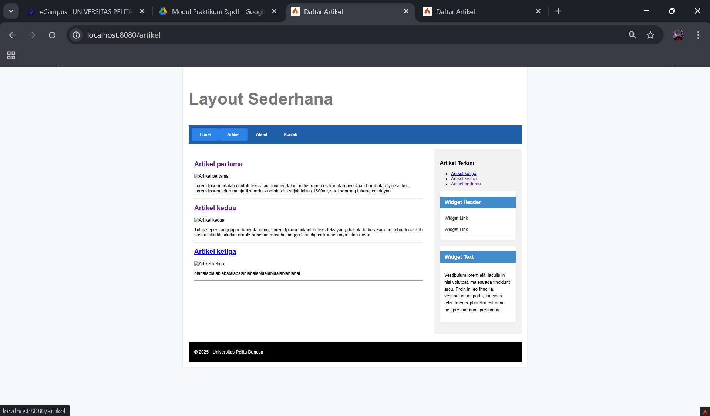
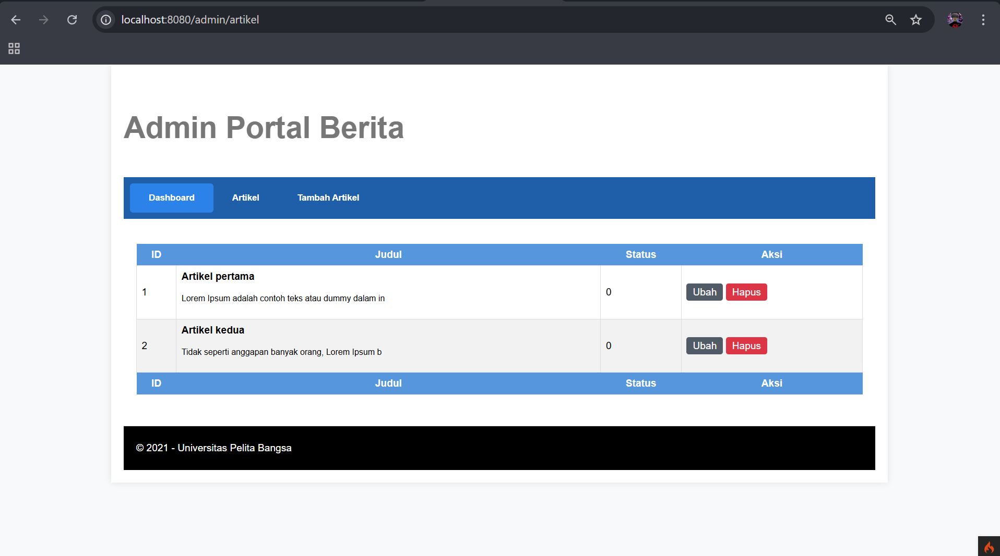
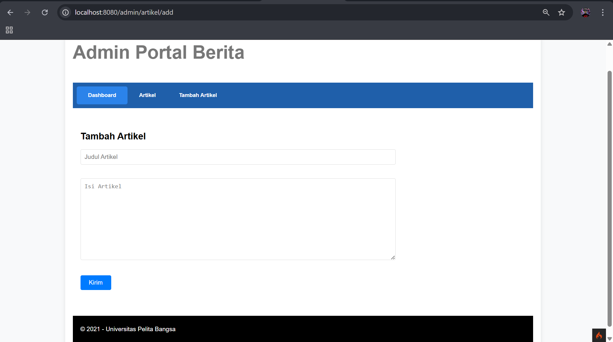
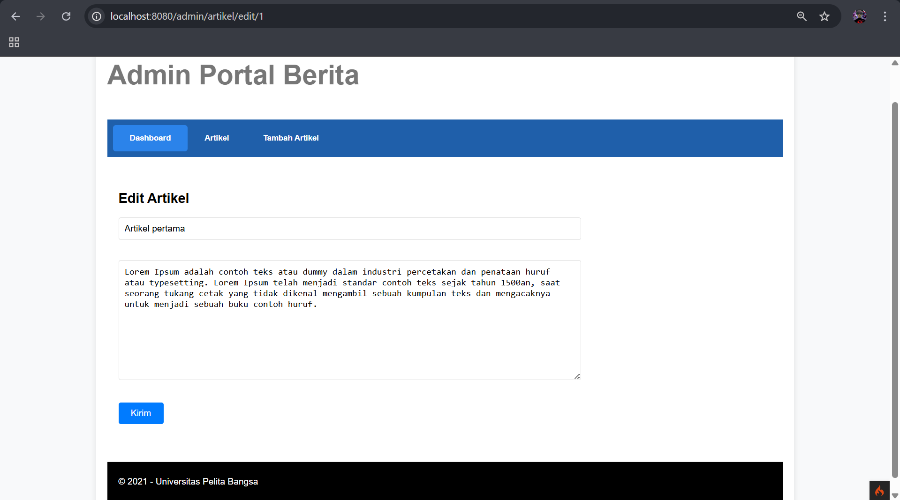

# Lab7Web
| Keterangan | Data                |
| ---------- | ------------------- |
| **Nama**   | Zaky Putra Pratama |
| **NIM**    | 312310613           |
| **Kelas**  | TI.23.A6            |
| **MatKul**  | Pemograman web 2   |
| **Dosen**  | Agung Nugroho, S.Kom., M.Kom. |

## Modul 1: PHP Framework (CodeIgniter)
### Tujuan
* Memahami konsep dasar Framework dan MVC.
* Instalasi dan konfigurasi CodeIgniter 4.
* Membuat program sederhana dengan Controller, Model, dan View.
### Langkah-langkah
* Konfigurasi PHP & Web Server: Mengaktifkan ekstensi seperti php-json, php-mysqlnd, dll.
  - Instalasi CodeIgniter: Mengunduh secara manual dan mengonfigurasi env.
  - Menjalankan CLI (php spark): Untuk debugging dan pengembangan.
* Memahami Struktur Direktori: Memahami folder utama seperti app, public, vendor.
* Membuat Routing & Controller:
  - Menentukan routing di app/Config/Routes.php.
  - Membuat Controller di app/Controllers/Page.php.
* Membuat View: Implementasi tampilan dengan file app/Views/about.php.
* Layout dengan CSS: Memisahkan template header.php dan footer.php untuk efisiensi.

## Modul 2: Framework Lanjutan (CRUD)
### Tujuan
* Memahami konsep Model dan CRUD.
* Membuat aplikasi CRUD dengan CodeIgniter 4.
* Mengelola data Artikel dalam database MySQL.
### Langkah-langkah
* Persiapan Database:
  - Membuat database lab_ci4 dan tabel artikel.
```ymal
MariaDB [lab_cid]> desc artikel;
+------------+--------------+------+-----+-------------------+-------------------+
| Field      | Type         | Null | Key | Default           | Extra             |
+------------+--------------+------+-----+-------------------+-------------------+
| id         | int(11)      | NO   | PRI | NULL              | auto_increment    |
| judul      | varchar(200) | NO   |     | NULL              |                   |
| isi        | text         | YES  |     | NULL              |                   |
| gambar     | varchar(200) | YES  |     | NULL              |                   |
| status     | tinyint(1)   | YES  |     | 0                 |                   |
| slug       | varchar(200) | YES  |     | NULL              |                   |
| created_at | datetime     | YES  |     | CURRENT_TIMESTAMP | DEFAULT_GENERATED |
| updated_at | datetime     | YES  |     | CURRENT_TIMESTAMP | DEFAULT_GENERATED |
| kategori   | varchar(100) | YES  |     | NULL              |                   |
+------------+--------------+------+-----+-------------------+-------------------+
```
  - Menghubungkan database melalui file .env.
```
database.default.hostname = localhost
database.default.database = lab_ci4
database.default.username = root
database.default.password = 
database.default.DBDriver = MySQLi
database.default.DBPrefix =
database.default.port = 3306
```
* Membuat Model (ArtikelModel.php): Mengatur data yang bisa diakses dari tabel artikel.
* Membuat Controller (Artikel.php):
  - Method index(): Menampilkan daftar artikel.
  - Method view($slug): Menampilkan detail artikel.
  - Method admin_index(): Halaman admin untuk CRUD.
  - Method add(), edit(), delete(): Operasi CRUD.
* Membuat View (index.php, detail.php, admin_index.php): Tampilan untuk frontend dan admin.
* Routing (app/Config/Routes.php): Menambahkan rute untuk halaman artikel dan admin.

## Modul 3: View Layout dan View Cell
### Tujuan
* Menggunakan View Layout untuk membuat template tampilan.
* Implementasi View Cell untuk komponen UI modular.
### Langkah-langkah
* Membuat Layout Utama (main.php):
  - Template utama dengan <?= $this->renderSection('content') ?>.
  - Navigasi dan sidebar dengan View Cell.
* Memodifikasi View:
  - Menggunakan extend('layout/main') agar tampilan konsisten.
* Membuat View Cell (ArtikelTerkini.php):
  - Menampilkan daftar artikel terbaru secara modular.
* Membuat View untuk View Cell (artikel_terkini.php):
  - Menampilkan daftar artikel sebagai widget sidebar.
 
## Cara Menjalankan 
* Pastikan XAMPP/MySQL sudah berjalan.
* Import database dari file lab_ci4.sql.
* Jalankan CodeIgniter dengan perintah:
```
php spark serve
```

* jalankan dengan link dibawah ini
```
http://localhost:8080/home
http://localhost:8080/admin/artikel (untuk admin)
```
### isi routes.php
```
$routes->get('/home', 'page::home');
$routes->get('/about', 'Page::about');
$routes->get('/contact', 'Page::contact');

$routes->get('/artikel', 'Artikel::index');
$routes->get('/artikel/(:any)', 'Artikel::view/$1');
$routes->group('admin', function($routes) {
    $routes->get('artikel', 'Artikel::admin_index');
    $routes->add('artikel/add', 'Artikel::add');
    $routes->add('artikel/edit/(:any)', 'Artikel::edit/$1');
    $routes->get('artikel/delete/(:any)', 'Artikel::delete/$1');
    });
```
## dokumentasi
### Tampilan codeigniter 4

### Tampilan jika eror

### Halaman home

### Halaman Artikel

### Artikel Detail

### Halaman About 

### Halaman Contact

### Halaman Admin 

### Admin add

### Admin update

