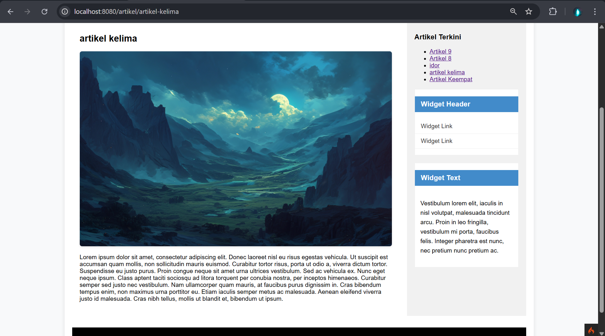

# Lab7Web
## UAS 

| Keterangan | Data                |
| ---------- | ------------------- |
| **Nama**   | Zaky Putra Pratama |
| **NIM**    | 312310613           |
| **Kelas**  | TI.23.A6            |
| **MatKul**  | Pemograman web 2   |
| **Dosen**  | Agung Nugroho, S.Kom., M.Kom. |

## Daftar Isi Praktikum
| No. | Praktikum       | Link                                                                 |
|-----|------------------|----------------------------------------------------------------------|
| 1   | Praktikum 1      | [Lihat](#praktikum-1-php-framework-codeigniter)                      |
| 2   | Praktikum 2      | [Lihat](#praktikum-2-framework-lanjutan-crud)                        |
| 3   | Praktikum 3      | [Lihat](#praktikum-3-view-layout-dan-view-cell)                      |
| 4   | Praktikum 4      | [Lihat](#praktikum-4--modul-login)                                   |
| 5   | Praktikum 5      | [Lihat](#praktikum-5--pagination-dan-pencarian)                      |
| 6   | Praktikum 6      | [Lihat](#praktikum-6--upload-file-gambar)                            |
| 7   | Praktikum 7      | [Lihat](#praktikum-7--relasi-tabel-dan-query-builder)                |
| 8   | Praktikum 8      | [Lihat](#praktikum-8--ajax)                                          |
| 9   | Praktikum 9      | [Lihat](#praktikum-9--implementasi-ajax-pagination-dan-search)       |
| 10  | Praktikum 10     | [Lihat](#praktikum-10--api)                                          |
| 11  | Praktikum 11     | [Lihat](#praktikum-11--vuejs)                                        |

## Praktikum 1: PHP Framework (CodeIgniter)
### Tujuan
* Memahami konsep dasar Framework dan MVC.
* Instalasi dan konfigurasi CodeIgniter 4.
* Membuat program sederhana dengan Controller, Model, dan View.
### Langkah-langkah
* Konfigurasi PHP & Web Server: Mengaktifkan ekstensi seperti php-json, php-mysqlnd, dll.
  - Instalasi CodeIgniter: Mengunduh secara manual dan mengonfigurasi env.
  - Menjalankan CLI (php spark): Untuk debugging dan pengembangan.
* Memahami Struktur Direktori: Memahami folder utama seperti app, public, vendor.
* Membuat Routing & Controller:
  - Menentukan routing di app/Config/Routes.php.
  - Membuat Controller di app/Controllers/Page.php.
* Membuat View: Implementasi tampilan dengan file app/Views/about.php.
* Layout dengan CSS: Memisahkan template header.php dan footer.php untuk efisiensi.

## Praktikum 2: Framework Lanjutan (CRUD)
### Tujuan
* Memahami konsep Model dan CRUD.
* Membuat aplikasi CRUD dengan CodeIgniter 4.
* Mengelola data Artikel dalam database MySQL.
### Langkah-langkah
* Persiapan Database:
  - Membuat database lab_ci4 dan tabel artikel.
```ymal
MariaDB [lab_cid]> desc artikel;
+------------+--------------+------+-----+-------------------+-------------------+
| Field      | Type         | Null | Key | Default           | Extra             |
+------------+--------------+------+-----+-------------------+-------------------+
| id         | int(11)      | NO   | PRI | NULL              | auto_increment    |
| judul      | varchar(200) | NO   |     | NULL              |                   |
| isi        | text         | YES  |     | NULL              |                   |
| gambar     | varchar(200) | YES  |     | NULL              |                   |
| status     | tinyint(1)   | YES  |     | 0                 |                   |
| slug       | varchar(200) | YES  |     | NULL              |                   |
| created_at | datetime     | YES  |     | CURRENT_TIMESTAMP | DEFAULT_GENERATED |
| updated_at | datetime     | YES  |     | CURRENT_TIMESTAMP | DEFAULT_GENERATED |
| kategori   | varchar(100) | YES  |     | NULL              |                   |
+------------+--------------+------+-----+-------------------+-------------------+
```
  - Menghubungkan database melalui file .env.
```
database.default.hostname = localhost
database.default.database = lab_ci4
database.default.username = root
database.default.password = 
database.default.DBDriver = MySQLi
database.default.DBPrefix =
database.default.port = 3306
```
* Membuat Model (ArtikelModel.php): Mengatur data yang bisa diakses dari tabel artikel.
* Membuat Controller (Artikel.php):
  - Method index(): Menampilkan daftar artikel.
  - Method view($slug): Menampilkan detail artikel.
  - Method admin_index(): Halaman admin untuk CRUD.
  - Method add(), edit(), delete(): Operasi CRUD.
```php
<?php

namespace App\Controllers;

use App\Models\ArtikelModel;

class Artikel extends BaseController
{
    public function index()
    {
        $title = 'Daftar Artikel';
        $model = new ArtikelModel();
        $artikel = $model->findAll();

        return view('artikel/index', compact('artikel', 'title'));
    }

    public function view($slug)
    {
        $model = new ArtikelModel();
        $artikel = $model->where(['slug' => $slug])->first();

        // Menampilkan error apabila data tidak ada.
        if (!$artikel) {
            throw PageNotFoundException::forPageNotFound();
        }

        $title = $artikel['judul'];
        return view('artikel/detail', compact('artikel', 'title'));
    }

    public function admin_index()
    {
        $title = 'Daftar Artikel';
        $model = new ArtikelModel();
        $artikel = $model->findAll();

        return view('artikel/admin_index', compact('artikel', 'title'));
    }

    public function add()
    {
        // Validasi data.
        $validation = \Config\Services::validation();
        $validation->setRules(['judul' => 'required']);
        $isDataValid = $validation->withRequest($this->request)->run();

        if ($isDataValid) {
            $artikel = new ArtikelModel();
            $artikel->insert([
                'judul' => $this->request->getPost('judul'),
                'isi' => $this->request->getPost('isi'),
                'slug' => url_title($this->request->getPost('judul')),
            ]);
            return redirect('admin/artikel');
        }

        $title = "Tambah Artikel";
        return view('artikel/form_add', compact('title'));
    }

    public function edit($id)
    {
        $artikel = new ArtikelModel();

        // Validasi data.
        $validation = \Config\Services::validation();
        $validation->setRules(['judul' => 'required']);
        $isDataValid = $validation->withRequest($this->request)->run();

        if ($isDataValid) {
            $artikel->update($id, [
                'judul' => $this->request->getPost('judul'),
                'isi' => $this->request->getPost('isi'),
            ]);
            return redirect('admin/artikel');
        }

        // Ambil data lama.
        $data = $artikel->where('id', $id)->first();
        $title = "Edit Artikel";

        return view('artikel/form_edit', compact('title', 'data'));
    }

    public function delete($id)
    {
        $artikel = new ArtikelModel();
        $artikel->delete($id);
        return redirect('admin/artikel');
    }
}
```
* Membuat View (index.php, detail.php, admin_index.php): Tampilan untuk frontend dan admin.
* Routing (app/Config/Routes.php): Menambahkan rute untuk halaman artikel dan admin.


## Pratikum 3: View Layout dan View Cell

### Tujuan
* Menggunakan View Layout untuk membuat template tampilan.
* Implementasi View Cell untuk komponen UI modular.
### Langkah-langkah
* Membuat Layout Utama (main.php):
  - Template utama dengan <?= $this->renderSection('content') ?>.
  - Navigasi dan sidebar dengan View Cell.
* Memodifikasi View:
  - Menggunakan extend('layout/main') agar tampilan konsisten.
* Membuat View Cell (ArtikelTerkini.php):
  - Menampilkan daftar artikel terbaru secara modular.
* Membuat View untuk View Cell (artikel_terkini.php):
  - Menampilkan daftar artikel sebagai widget sidebar.
 
## Cara Menjalankan 
* Pastikan XAMPP/MySQL sudah berjalan.
* Import database dari file lab_ci4.sql.
* Jalankan CodeIgniter dengan perintah:
```
php spark serve
```

* jalankan dengan link dibawah ini
```
http://localhost:8080/home
http://localhost:8080/admin/artikel (untuk admin)
```
### isi routes.php
```php
$routes->get('/home', 'page::home');
$routes->get('/about', 'Page::about');
$routes->get('/contact', 'Page::contact');

$routes->get('/artikel', 'Artikel::index');
$routes->get('/artikel/(:any)', 'Artikel::view/$1');
$routes->group('admin', function($routes) {
    $routes->get('artikel', 'Artikel::admin_index');
    $routes->add('artikel/add', 'Artikel::add');
    $routes->add('artikel/edit/(:any)', 'Artikel::edit/$1');
    $routes->get('artikel/delete/(:any)', 'Artikel::delete/$1');
    });
```
## dokumentasi
### Tampilan codeigniter 4


### Tampilan jika eror

### Halaman home

### Halaman Artikel

### Artikel Detail

### Halaman About 

### Halaman Contact

### Halaman Admin 

### Admin add

### Admin update


## Praktikum 4 : Modul Login
* jalankan perintah 
```
http://localhost:8080/user/login
```
### Hasil


## Praktikum 5 : Pagination dan Pencarian
### Pagination
Membagi daftar artikel di admin artikel setiap 3 artikel 

### Pencarian
Membuat fungsi pencarian untuk memudahkan <br> 
mencari data artikel di admin artikel


## Praktikum 6 : Upload File Gambar
### Pada Bagian Admin
Membuat fungsi tambah gambar di admin artikel dibagian tambah artikel dan edit

### Pada Bagian Artikel View
Hasil tampilan setelah menambah gambar dari admin 

### Pada bagian Detail Artikel
hasil tampilan ketika artikel ditekan dan menampilkan detail artikel


## Praktikum 7 : Relasi Tabel dan Query Builder
* Buat tabel kategori terlebih dahulu
```bash
CREATE TABLE kategori (
    id_kategori     INT(11) AUTO_INCREMENT PRIMARY KEY,
    nama_kategori   VARCHAR(100) NOT NULL,
    slug_kategori   VARCHAR(100)
);
```
* Ubah tabel artikel<br>
Tambahkan foreign key (id_kategori) pada tabel (artikel) untuk membuat relasi dengan tabel kategori.

### Pada Artikel View
Hasil setelah menambah filter kategori di artikel

### Pada Admin Artikel
Hasil setelah menambah filter kategori di admin artikel 


## Praktikum 8 : AJAX
AJAX merupakan singkatan dari Asynchronous JavaScript and XML. <br>
meskipun kepanjangannya menyebutkan XML, pada praktiknya AJAX tidak terbatas pada
penggunaan XML saja. <br>
AJAX adalah kumpulan teknik pengembangan web yang <br>
memungkinkan aplikasi web bekerja secara asynchronous (tidak langsung).<br>
dengan kata lain, AJAX memungkinkan aplikasi web untuk memperbarui dan <br>
menampilkan data dari server tanpa harus melakukan reload halaman secara <br>
keseluruhan. Hal ini membuat aplikasi web terasa lebih responsif dan dinamis.

### persiapan
* Download pustaka jQuery versi terbaru dari https://jquery.com dan ekstrak filenya.<br> Salin file jquery-3.7.1.min.js ke folder public/assets/js.
* Buat Ajax Controller di controller
```php
<?php
namespace App\Controllers;

use CodeIgniter\Controller;
use CodeIgniter\HTTP\Request;
use CodeIgniter\HTTP\Response;
use App\Models\ArtikelModel;

class AjaxController extends Controller
{
    public function index()
    {
        return view('ajax/index');
    }

    public function getData()
    {
        $model = new ArtikelModel();
        $data = $model->findAll();
        // Kirim data dalam format JSON
        return $this->response->setJSON($data);
    }

    public function delete($id)
    {
        $model = new ArtikelModel();
        $data = $model->delete($id);
        $data = [
            'status' => 'OK'
        ];
        // Kirim data dalam format JSON
        return $this->response->setJSON($data);
    }
}
```
* Buat View
```php
<?= $this->include('template/header'); ?>

<h1>Data Artikel</h1>

<table class="table-data" id="artikelTable">
    <thead>
        <tr>
            <th>ID</th>
            <th>Judul</th>
            <th>Status</th>
            <th>Aksi</th>
        </tr>
    </thead>
    <tbody></tbody>
</table>

<script src="<?= base_url('assets/js/jquery-3.7.1.min.js') ?>"></script>
<script>
$(document).ready(function() {
    // Function to display a loading message while data is fetched
    function showLoadingMessage() {
        $('#artikelTable tbody').html('<tr><td colspan="4">Loading data...</td></tr>');
    }

    // Buat fungsi load data
    function loadData() {
        showLoadingMessage(); // Display loading message initially

        // Lakukan request AJAX ke URL getData
        $.ajax({
            url: "<?= base_url('ajax/getData') ?>",
            method: "GET",
            dataType: "json",
            success: function(data) {
                // Tampilkan data yang diterima dari server
                var tableBody = "";
                for (var i = 0; i < data.length; i++) {
                    var row = data[i];
                    tableBody += '<tr>';
                    tableBody += '<td>' + row.id + '</td>';
                    tableBody += '<td>' + row.judul + '</td>';

                    // Add a placeholder for the "Status" column (modify as needed)
                    tableBody += '<td><span class="status">---</span></td>';

                    tableBody += '<td>';
                    // Replace with your desired actions (e.g., edit, delete)
                    tableBody += '<a href="<?= base_url('artikel/edit/') ?>' + row.id + '" class="btn btn-primary">Edit</a>';
                    tableBody += ' <a href="#" class="btn btn-danger btn-delete" data-id="' + row.id + '">Delete</a>';
                    tableBody += '</td>';

                    tableBody += '</tr>';
                }
                $('#artikelTable tbody').html(tableBody);
            }
        });
    }

    loadData();

    // Implement actions for buttons (e.g., delete confirmation)
    $(document).on('click', '.btn-delete', function(e) {
        e.preventDefault();
        var id = $(this).data('id');

        // hapus data;
        if (confirm('Apakah Anda yakin ingin menghapus artikel ini?')) {
            $.ajax({
                url: "<?= base_url('artikel/delete/') ?>" + id,
                method: "DELETE",
                success: function(data) {
                    loadData(); // Reload Datatables to reflect changes
                },
                error: function(jqXHR, textStatus, errorThrown) {
                    alert('Error deleting article: ' + textStatus + errorThrown);
                }
            });
        }

        console.log('Delete button clicked for ID:', id);
    });
});
</script>

<?= $this->include('template/footer'); ?>
```
## Praktikum 9 : Iplementasi AJAX Pagination dan Search
Mengimplementasikan AJAX pada paginatian dan search
* Modifikasi Controller Artikel <br> Ubah method `admin_index()` di `Artikel.php` untuk mengembalikan data dalam format <br> JSON jika request adalah AJAX. 
```php
    public function admin_index()
    {
        $title = 'Daftar Artikel (Admin)';
        $q = $this->request->getVar('q') ?? '';
        $kategori_id = $this->request->getVar('kategori_id') ?? '';

        $model = new ArtikelModel();

        // Query builder dengan join kategori
        $builder = $model->table('artikel')
                        ->select('artikel.*, kategori.nama_kategori')
                        ->join('kategori', 'kategori.id_kategori = artikel.id_kategori', 'left');

        if (!empty($q)) {
            $builder->like('artikel.judul', $q);
        }

        if (!empty($kategori_id)) {
            $builder->where('artikel.id_kategori', $kategori_id);
        }

        // Pagination 3 per halaman
        $perPage = 3;
        $artikel = $builder->paginate($perPage);
        $pager = $model->pager;

        $data = [
            'title'       => $title,
            'artikel'     => $artikel,
            'pager'       => $pager,
            'q'           => $q,
            'kategori_id' => $kategori_id,
        ];

        if ($this->request->isAJAX()) {
            // Ambil HTML pagination-nya sebagai string
            $pagerLinks = $pager->only(['q', 'kategori_id'])->links('default', 'custom_pagination');

            $data['pager_links'] = $pagerLinks;

            return $this->response->setJSON($data);
        } else {
            $kategoriModel = new KategoriModel();
            $data['kategori'] = $kategoriModel->findAll();

            return view('artikel/admin_index', $data);
        }
    }
```
* Modifikasi View (admin_index.php)
```php
<?= $this->include('template/admin_header'); ?>

<h2><?= $title; ?></h2>

<!-- Form Pencarian dan Filter Kategori -->
<form id="search-form" class="form-search mb-3 d-flex align-items-center gap-2">
    <select name="kategori_id" id="category-filter" class="form-select w-auto">
        <option value="">Kategori</option>
        <?php foreach ($kategori as $kat): ?>
            <option value="<?= $kat['id_kategori']; ?>" <?= ($kategori_id == $kat['id_kategori']) ? 'selected' : ''; ?>>
                <?= esc($kat['nama_kategori']); ?>
            </option>
        <?php endforeach; ?>
    </select>
    <input type="text" name="q" id="search-box" value="<?= esc($q); ?>" placeholder="Cari data" class="form-control w-auto">
    <input type="submit" value="Cari" class="btn btn-primary">
</form>

<!-- Kontainer Artikel dan Pagination -->
<div id="article-container"></div>
<div id="pagination-container" class="mt-3"></div>

<!-- jQuery -->
<script src="https://code.jquery.com/jquery-3.7.1.min.js"></script>
<script>
$(document).ready(function() {
    const articleContainer = $('#article-container');
    const paginationContainer = $('#pagination-container');
    const searchForm = $('#search-form');
    const searchBox = $('#search-box');
    const categoryFilter = $('#category-filter');

    function fetchData(url = '/admin/artikel') {
        $.ajax({
            url: url,
            type: 'GET',
            dataType: 'json',
            headers: { 'X-Requested-With': 'XMLHttpRequest' },
            success: function(data) {
                renderArticles(data.artikel, data.pager_links);
                // renderPagination(data.pager_links);
            }
        });
    }

    function renderArticles(articles, pagerHtml) {
        let html = '<table class="table table-bordered">';
        html += `
            <thead>
                <tr>
                    <th>ID</th>
                    <th>Judul</th>
                    <th>Kategori</th>
                    <th>Status</th>
                    <th>Aksi</th>
                </tr>
            </thead><tbody>
        `;

        if (articles.length > 0) {
            articles.forEach(article => {
                html += `
                    <tr>
                        <td>${article.id}</td>
                        <td>
                            <b>${article.judul}</b>
                            <p><small>${article.isi.substring(0, 50)}</small></p>
                        </td>
                        <td>${article.nama_kategori}</td>
                        <td>${article.status}</td>
                        <td>
                            <a class="btn btn-sm btn-info" href="/admin/artikel/edit/${article.id}">Ubah</a>
                            <a class="btn btn-sm btn-danger" onclick="return confirm('Yakin menghapus data?');" href="/admin/artikel/delete/${article.id}">Hapus</a>
                        </td>
                    </tr>
                `;
            });
        } else {
            html += '<tr><td colspan="5" class="text-center">Belum ada data.</td></tr>';
        }

        html += '</tbody></table>';

        // Tambahkan pagination di bawah tabel
        html += `<div class="pagination-container mt-3">${pagerHtml || ''}</div>`;

        articleContainer.html(html);
    }

    function renderPagination(pagerHtml) {
        paginationContainer.html(pagerHtml || '');
    }
    // Form pencarian
    searchForm.on('submit', function(e) {
        e.preventDefault();
        const q = searchBox.val();
        const kategori_id = categoryFilter.val();
        fetchData(`/admin/artikel?q=${q}&kategori_id=${kategori_id}`);
    });

    // Trigger submit saat ganti kategori
    categoryFilter.on('change', function() {
        searchForm.trigger('submit');
    });

    // Tangani klik pagination
    $(document).on('click', '.pagination a', function(e) {
        e.preventDefault();
        const url = $(this).attr('href');
        fetchData(url);
    });

    // Muat awal
    fetchData();
});
</script>

<?= $this->include('template/admin_footer'); ?>
```
## Praktikum 10 : API
### Persiapan
* kita gunakan postman sebagai rest client untuk testing API
* buat rest controller yaitu post.php berisi CRUD untuk digunakan testing melalui postman
```php
<?php

namespace App\Controllers;

use CodeIgniter\RESTful\ResourceController;
use CodeIgniter\API\ResponseTrait;
use App\Models\ArtikelModel;
use App\Models\KategoriModel;

class Post extends ResourceController
{
    use ResponseTrait;

    public function index()
    {
        $model = new ArtikelModel();
        $data['artikel'] = $model->select('artikel.*, kategori.nama_kategori')
                                 ->join('kategori', 'kategori.id_kategori = artikel.id_kategori', 'left')
                                 ->orderBy('artikel.id', 'DESC')
                                 ->findAll();
        return $this->respond($data);
    }

    public function kategori()
    {
        $kategoriModel = new KategoriModel();
        $data['kategori'] = $kategoriModel->findAll();
        return $this->respond($data);
    }

    public function create()
    {
        $model = new ArtikelModel();

        $gambar = $this->request->getFile('gambar');
        $namaGambar = '';

        if ($gambar && $gambar->isValid() && !$gambar->hasMoved()) {
            $namaGambar = $gambar->getRandomName();
            $gambar->move(ROOTPATH . 'public/gambar', $namaGambar);
        }

        $data = [
            'judul'       => $this->request->getPost('judul'),
            'isi'         => $this->request->getPost('isi'),
            'status'      => $this->request->getPost('status') ?? 0,
            'id_kategori' => $this->request->getPost('id_kategori'),
            'slug'        => url_title($this->request->getPost('judul'), '-', true),
            'gambar'      => $namaGambar,
        ];

        if (!$model->insert($data)) {
            return $this->failValidationErrors($model->errors());
        }

        return $this->respondCreated(['message' => 'Artikel berhasil ditambahkan']);
    }

    public function update($id = null)
    {
        $model = new ArtikelModel();
        $dataLama = $model->find($id);
        if (!$dataLama) return $this->failNotFound('Data tidak ditemukan');

        $gambar = $this->request->getFile('gambar');
        $namaGambar = $dataLama['gambar']; // default: pakai yang lama

        if ($gambar && $gambar->isValid() && !$gambar->hasMoved()) {
            $namaGambar = $gambar->getRandomName();
            $gambar->move(ROOTPATH . 'public/gambar', $namaGambar);
        }

        $data = [
            'judul'       => $this->request->getPost('judul'),
            'isi'         => $this->request->getPost('isi'),
            'status'      => $this->request->getPost('status') ?? 0,
            'id_kategori' => $this->request->getPost('id_kategori'),
            'slug'        => url_title($this->request->getPost('judul'), '-', true),
            'gambar'      => $namaGambar,
        ];

        if (!$model->update($id, $data)) {
            return $this->failValidationErrors($model->errors());
        }

        return $this->respond(['message' => 'Artikel berhasil diubah']);
    }

    public function delete($id = null)
    {
        $model = new ArtikelModel();
        $data = $model->find($id);
        if (!$data) return $this->failNotFound('Data tidak ditemukan');

        // Hapus file gambar dari public/gambar
        if (!empty($data['gambar']) && file_exists(ROOTPATH . 'public/gambar/' . $data['gambar'])) {
            unlink(ROOTPATH . 'public/gambar/' . $data['gambar']);
        }

        $model->delete($id);

        return $this->respondDeleted(['message' => 'Artikel berhasil dihapus']);
    }
}
```
* Tambahkan routing REST API ke Routes.php
```php
$routes->resource('post');
```
* Cek routes di melalui terminal
```bash
php spark routes
```
### Hasil


## Praktikum 11 : VueJS
### Persiapan
* Buat folder baru di docroot (htdocs) dengan nama lab8_vuejs
```
index.html
└───assets/
    ├───css/
    │   └── style.css
    └───js/
        └── app.js

```
* Library vuejs
```javascript
<script src="https://unpkg.com/vue@3/dist/vue.global.js"></script>
```
* Library axios
```javascript
<script src="https://unpkg.com/axios/dist/axios.min.js"></script>
```
### Hasil


end. :)